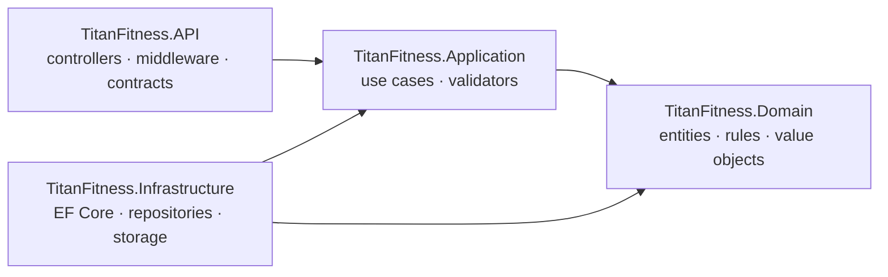

# Titan Fitness · Staff Portal

> A full-stack front-desk and branch-management system for a multi-branch gym.
> **Angular 20** frontend + **.NET 8** layered Web API + **SQL Server**.

Staff use it to check members in, manage memberships and freezes, schedule and book classes, and maintain trainers and membership plans across branches.

```
titan-fitness/
├── backend/    .NET 8 Web API (Domain · Application · Infrastructure · API)
└── frontend/   Angular 20 staff portal
```

---

## Table of contents

1. [Features](#features)
2. [Run it locally](#run-it-locally)
3. [Backend: what is implemented](#backend-what-is-implemented)
4. [Frontend: what is implemented](#frontend-what-is-implemented)
5. [How the two sides talk](#how-the-two-sides-talk)
6. [Troubleshooting](#troubleshooting)

---

## Features

| Area | What staff can do |
|---|---|
| **Dashboard** | Live KPIs (check-ins today, active members), today's upcoming classes with search, quick actions |
| **Members** | Searchable, sortable, filterable directory; profile with plan, usage and recent activity; add/edit member; freeze a membership with a live "projected end date" |
| **Classes** | Day/week schedule per branch, capacity overview, schedule/edit classes, book a member into a session |
| **Trainers** | Directory with filters; one details page for view, add and edit |
| **Plans** | Catalogue with filters (duration, access, price range, status); one details page for view, add and edit |
| **Check-in** | "New Check-in" dialog available from any screen, with an admit/refuse decision and the reason |

---

## Run it locally

### Prerequisites

| Tool | Version |
|---|---|
| .NET SDK | 8.0 |
| SQL Server | LocalDB, Express or full (the default connection string uses `localhost`) |
| Node.js | 20.19 or newer |
| Visual Studio 2022 (optional) | 17.12+ if you want to open the `.slnx` solution file |

### 1. Backend

```bash
cd backend
```

**a) Check the connection string** in `TitanFitness.API/appsettings.json`:

```
Server=localhost;Database=TitanFitnessDb;Trusted_Connection=True
```

Change `Server=` if your SQL Server instance has a different name (for example `localhost\SQLEXPRESS`). If SQL Server complains about the certificate, add `;TrustServerCertificate=True`.

**b) Create the database** by applying the EF Core migrations:

```bash
dotnet tool install --global dotnet-ef        # once, if you do not have it
dotnet ef database update --project TitanFitness.Infrastructure --startup-project TitanFitness.API
```

(Visual Studio alternative: Package Manager Console → set `TitanFitness.Infrastructure` as default project → `Update-Database`.)

**c) (Optional) Load demo data.** Run the seed script against `TitanFitnessDb` in SSMS or Azure Data Studio. It wipes the tables and creates branches, plans, trainers, members, classes and check-ins. All dates are relative to "now", so today always has classes and an in-progress session.

**d) Start the API:**

```bash
dotnet run --project TitanFitness.API --launch-profile https
```

The API listens on `https://localhost:7259`. Open `https://localhost:7259/swagger` once and accept the development certificate (or run `dotnet dev-certs https --trust`).

### 2. Frontend

```bash
cd frontend
npm install
npm start
```

Open <http://localhost:4200>.

> The API allows CORS **only** from `http://localhost:4200`, so keep that port.

| Script | Purpose |
|---|---|
| `npm start` | Dev server with live reload |
| `npm run build` | Production build into `dist/` |
| `npm run watch` | Development build in watch mode |

If the API runs on another address, edit `frontend/src/environments/environment.ts`:

| Key | Meaning |
|---|---|
| `apiUrl` | API base URL (`https://localhost:7259/api`) |
| `filesUrl` | Base URL for uploaded member photos |

---

## Backend: what is implemented

### Architecture

A layered (clean-architecture style) solution where dependencies point inward only:



| Project | Responsibility |
|---|---|
| `TitanFitness.Domain` | Entities, enums, value objects, repository interfaces and **business rules** as domain services. No framework dependencies. |
| `TitanFitness.Application` | One folder per use case (command or query) holding its request, handler and validator. Talks to persistence only through abstractions. |
| `TitanFitness.Infrastructure` | EF Core `DbContext`, entity configurations, migrations, repositories, query read services, transaction manager, file storage. |
| `TitanFitness.API` | Thin controllers, request contracts, global exception middleware, CORS, Swagger, static files. |

### Topics covered

**Design and structure**
- **Command/Query separation (CQRS style).** Writes go through command handlers and reads through query handlers. Handlers are plain classes registered in the DI container, with no mediator library, so the flow is easy to follow.
- **Domain-driven building blocks.** Rich entities (`Member`, `Membership`, `Plan`, `ClassSession`, `Booking`, `CheckIn`, `Freeze`, `GuestPass`, `Trainer`, `Branch`, `Studio`) that protect their own invariants, plus value objects (`AgreedTerms`, `TimeRange`).
- **Domain services for cross-entity rules:** `CheckInEligibilityService` (admit or refuse with a reason), `BookingEligibilityService`, `SessionConflictChecker` and `MembershipOverlapChecker`.
- **Repository + Unit of Work** abstractions in the domain/application layers, implemented in Infrastructure, with an `ITransactionManager` for operations that must succeed or fail together.
- **Separate read services** for list and dashboard screens: projections with `AsNoTracking`, built for the screen instead of loading whole aggregates.
- **Dependency injection** end to end, with an `AddInfrastructure` extension to keep `Program.cs` clean.

**Business rules**
- Membership lifecycle with statuses `Pending → Active → Frozen / Expired / Cancelled`.
- **Freeze rules** driven by the plan's agreed terms (maximum freeze days and maximum number of freezes), with remaining allowance calculated on the server and a freeze-context endpoint feeding the "projected end date" in the UI.
- **Check-in eligibility:** the result is `Admitted` or `Refused` with a human-readable reason.
- **Class scheduling and booking:** session status flow `Open → InProgress → Completed / Cancelled`, capacity handling, conflict detection and booking eligibility.
- **Plans:** price, duration, access scope (`AccessScope`), per-branch availability (`PlanBranch`) and agreed terms stored with each membership.
- **Guest passes:** issue and use, per membership.

**Data**
- **EF Core + SQL Server** with Fluent API configuration per entity (one `*Configuration` class each) and **code-first migrations**.
- Many-to-many plan/branch availability, optional trainer on a class session (migration), field length limits aligned with validation.
- Local file storage service for member photos, served through static files.
- SQL seed script for demo data.

**Validation and errors**
- **FluentValidation** validators for every command that accepts input.
- **Global `ExceptionHandlingMiddleware`** that converts exceptions into consistent JSON problem responses:

| Exception | HTTP status |
|---|---|
| Validation failure | 400 / 422 with per-field errors |
| `NotFoundException` | 404 |
| `ConflictException` | 409 |
| `ArgumentException`, `InvalidOperationException` | 400 |
| Anything else | 500 (logged) |

**API surface**
- REST controllers for Dashboard, Members, Memberships (freeze, renew, change plan, cancel, guest passes), Classes, Bookings, Check-ins, Plans, Trainers and Branches.
- Paging, sorting and filtering on directory endpoints, with a shared `PagedResult<T>`.
- Enums serialised as strings (`JsonStringEnumConverter`) so the frontend gets readable values.
- Swagger / OpenAPI for exploring and testing.
- CORS policy restricted to the Angular dev origin.

---

## Frontend: what is implemented

### Topics covered

**Modern Angular**
- **Standalone components only.** No NgModules.
- **Signals** for state: `signal`, `computed`, `effect`, plus signal-based `input()`, `output()` and `model()`.
- **New control flow:** `@if`, `@for`, `@switch`.
- **Typed reactive forms** with a shared helper that maps server validation errors (400/422) onto the matching fields.
- **Functional** HTTP interceptor and route guards (`HttpInterceptorFn`, `CanActivateFn`).
- **Lazy-loaded feature routes** (`loadComponent` / `loadChildren`), a role guard for manager-only areas, and a not-found fallback.

**UX decisions**
- **State lives in the URL.** Page, sort, search and filters are kept in the query string, so a list survives refresh, can be shared as a link, and "Back to list" returns to the exact same view.
- **One details page, three modes.** Trainers and Plans each use a single component for view, add and edit. Switching to edit changes the URL without a reload, and unsaved changes ask for confirmation.
- **One place for HTTP errors.** The interceptor turns network, 401, 403, 404, 409 and 5xx failures into the right toast, redirect or retry (a *Retry* action on failed GET requests), then re-throws so each screen can show its own message.
- Live feedback where it helps: freeze "projected end date", highlighted search matches, two-decimal price input, loading, empty and error states on every list.
- Accessibility basics: labelled controls, focus management in dialogs (`appAutofocus`), keyboard-friendly menus.

**Reusable building blocks** in `shared/`: paginator, sortable table header, row menu, status badge, avatar, confirm dialog, state messages, icons, custom directives (`appAutofocus`, `appClickOutside`, two-decimals input) and pure pipes (`highlight`, `freezeAllowance`).

**Light dependencies.** Plain CSS and inline SVG icons; Angular Material is used only for dialogs, snackbars, autocomplete and tooltips.

### Tech stack

Angular 20 · TypeScript 5.8 (strict) · RxJS · Angular Material (partial) · plain CSS

### Structure

```
frontend/src/app/
├── core/        shell layout, app-wide services, guards, interceptor, models, utils
├── shared/      reusable components, directives and pipes
├── dashboard/   members/   classes/   trainers/   plans/   check-ins/
└── app.routes.ts
```

Each feature folder holds its page components, child components, a service (`*.service.ts`), its models (`*.model.ts`) and its lazy routes (`*.routes.ts`). Every component has three files: `.ts`, `.html` and `.css`.

### Routes

| Path | Screen |
|---|---|
| `/dashboard` (default) | Dashboard |
| `/members` · `/members/:id` · `/members/:id/freeze` | Directory, profile, freeze |
| `/classes` | Class schedule |
| `/trainers` · `/trainers/new` · `/trainers/:id` · `/trainers/:id/edit` | Trainers (manager only) |
| `/plans` · `/plans/new` · `/plans/:id` · `/plans/:id/edit` | Plans (manager only) |
| `**` | Not found |

---

## How the two sides talk

```
Angular service ──HTTP/JSON──▶ Controller ──▶ Handler ──▶ Domain rules ──▶ Repository ──▶ SQL Server
        ▲                                                                                    │
        └────────────── typed models ◀── mapped response / consistent error JSON ◀───────────┘
```

Server errors arrive in one predictable shape, so the interceptor and the form helper can handle them in one place instead of in every screen.

---

## Troubleshooting

| Problem | Fix |
|---|---|
| Browser shows a network error on every request | The API is not running, or its HTTPS certificate is not trusted. Open `https://localhost:7259/swagger` and accept it. |
| CORS error in the console | Run the frontend on exactly `http://localhost:4200`. |
| `Cannot open database "TitanFitnessDb"` | Run the migration command in step 1b. |
| SQL Server certificate error | Add `;TrustServerCertificate=True` to the connection string. |
| `npm install` fails | Check `node -v` (needs 20.19+). |

---

## Notes

Sign-in is a placeholder for now: the auth service holds a fixed manager session, and the interceptor and guards are already wired for a real token and roles.
